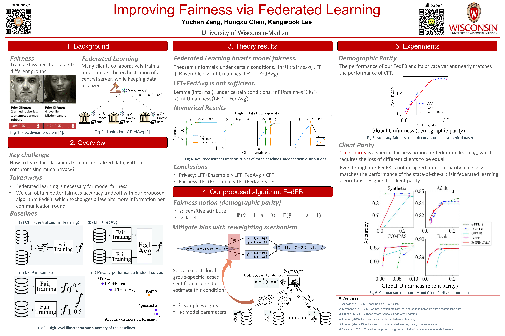

# Improving Fairness via Federated Learning

[Yuchen Zeng](https://yzeng58.github.io/zyc_cv/), [Hongxu Chen](https://sites.google.com/view/hongxuchen/home), [Kangwook Lee](https://kangwooklee.com/)

Links: [Paper](https://arxiv.org/pdf/2110.15545.pdf).

## Abstract

Recently, lots of algorithms have been proposed for learning a fair classifier from decentralized data. However, many theoretical and algorithmic questions remain open. First, is federated learning necessary, i.e., can we simply train locally fair classifiers and aggregate them? In this work, we first propose a new theoretical framework, with which we demonstrate that federated learning can strictly boost model fairness compared with such non-federated algorithms. We then theoretically and empirically show that the performance tradeoff of FedAvg-based fair learning algorithms is strictly worse than that of a fair classifier trained on centralized data. To bridge this gap, we propose FedFB, a private fair learning algorithm on decentralized data. The key idea is to modify the FedAvg protocol so that it can effectively mimic the centralized fair learning. Our experimental results show that FedFB significantly outperforms existing approaches, sometimes matching the performance of the centrally trained model.

## Repeating experiments

The code for producing each table and figure is provided as jupyter notebooks. 
